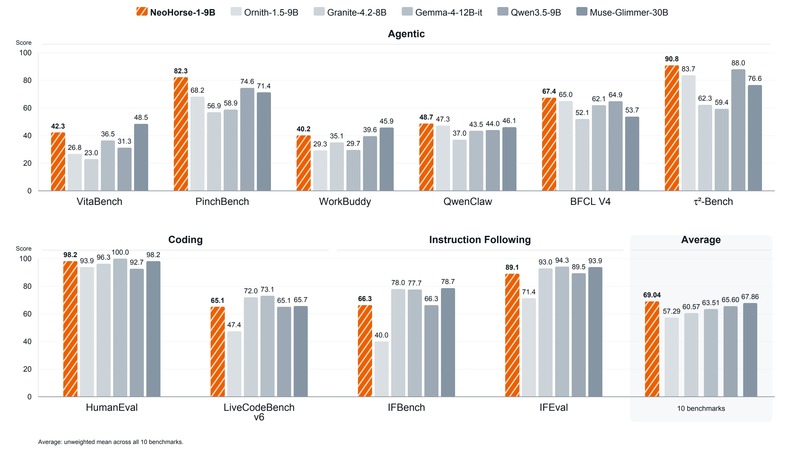

<div align="center">
  <h1>NeoHorse-1</h1>
  <p><b>Towards Recursive Self-Improvement via Agentic Post-Training with Routing Harness.</b></p>
</div>

<div align="center">
  <a href="https://huggingface.co/collections/TokenRhythm/neohorse-1"></a>
  <a href="https://tokenrhythm.ai/"></a>
  <a href="https://x.com/opensquilla"></a>
  <a href="https://www.apache.org/licenses/LICENSE-2.0"></a>
</div>

<div align="center"><a href="https://arxiv.org/abs/2609.08183">Technical Report</a></div>

NeoHorse-1 is a family of causal language models and an initial prototype on the path toward **recursive self-improvement (RSI)**. The 4B and 9B checkpoints are post-trained from Qwen3.5 for text-based agent harnesses, tool use, coding, and instruction following.

The routing harness assigns tasks to a heterogeneous model pool, records tool interactions and outcomes, estimates capability demand, and feeds capability-level feedback into the next training mixture. Updated models can return to the harness, forming a prototype evaluation–selection–update loop; extending this loop across successive iterations is the next step toward RSI.

## News

- **[2026-09-09]** 📄 **Technical report on arXiv!** Our [technical report](https://arxiv.org/abs/2609.08183) is now available, covering the routing harness, agentic post-training, and evaluation of NeoHorse-1.

- **[2026-09-08]** 📦 **GGUF and quantized models on Hugging Face!** We release [NeoHorse-1-4B-GGUF](https://huggingface.co/TokenRhythm/NeoHorse-1-4B-GGUF) and [NeoHorse-1-9B-GGUF](https://huggingface.co/TokenRhythm/NeoHorse-1-9B-GGUF). Both include **16-bit (BF16) weights** and **smaller 8-bit, 5-bit, and 4-bit quantized versions** that use less disk space and memory, making it easier to run NeoHorse on your own hardware.

- **[2026-09-08]** 🚀 **Now on ModelScope!** [NeoHorse-1-4B](https://www.modelscope.cn/models/TokenRhythm/NeoHorse-1-4B) and [NeoHorse-1-9B](https://www.modelscope.cn/models/TokenRhythm/NeoHorse-1-9B) are now available on ModelScope.

- **[2026-09-07]** 🎉 **NeoHorse-1 is here!** We release [NeoHorse-1-4B](https://huggingface.co/TokenRhythm/NeoHorse-1-4B) and [NeoHorse-1-9B](https://huggingface.co/TokenRhythm/NeoHorse-1-9B) under the **Apache 2.0** license.

<p align="center">
  <a href="./assets/4B_head_fig.jpg">
    
  </a>
</p>

<p align="center">
  <a href="./assets/9B_head_fig_v1.jpg">
    
  </a>
</p>

## Highlights

- **Agentic post-training framework:** routing-guided curriculum SFT and routing-guided on-policy distillation turn execution trajectories into training signal while preserving execution and harness context.
- **Data quality:** exact and near-duplicate removal, evaluation decontamination, structural validation, six-dimensional semantic evaluation, and subscene-level Scene/Goal/Outcome labeling.
- **Two release sizes:** 4B for a lighter local deployment footprint and 9B for higher capacity on the same text-first serving interface.

## Model Downloads

| Checkpoint | Parameters | Hugging Face | ModelScope | Base model |
| --- | :---: | --- | --- | --- |
| NeoHorse-1-4B | ~4B | [NeoHorse-1-4B](https://huggingface.co/TokenRhythm/NeoHorse-1-4B) | [NeoHorse-1-4B](https://www.modelscope.cn/models/TokenRhythm/NeoHorse-1-4B) | Qwen3.5-4B |
| NeoHorse-1-9B | ~9B | [NeoHorse-1-9B](https://huggingface.co/TokenRhythm/NeoHorse-1-9B) | [NeoHorse-1-9B](https://www.modelscope.cn/models/TokenRhythm/NeoHorse-1-9B) | Qwen3.5-9B |

Both checkpoints are released as text input/text output language-model weights for self-hosted inference. Each model card contains its model-specific evaluation table and deployment notes.

## Model Details

<table width="100%" style="width:100%;border-collapse:collapse;table-layout:fixed;font-size:14px">
<thead><tr><th style="padding:9px 10px;text-align:left;border-bottom:2px solid #f97316;color:#c2410c;background:#fff7ed">Property</th><th style="padding:9px 10px;text-align:left;border-bottom:2px solid #f97316;color:#c2410c;background:#fff7ed">NeoHorse-1-4B</th><th style="padding:9px 10px;text-align:left;border-bottom:2px solid #f97316;color:#c2410c;background:#fff7ed">NeoHorse-1-9B</th></tr></thead>
<tbody>
<tr><td style="padding:9px 10px;border-bottom:1px solid #fed7aa;font-weight:600">Model family</td><td style="padding:9px 10px;border-bottom:1px solid #fed7aa">NeoHorse Agent-Native Causal Language Model</td><td style="padding:9px 10px;border-bottom:1px solid #fed7aa">NeoHorse Agent-Native Causal Language Model</td></tr>
<tr><td style="padding:9px 10px;border-bottom:1px solid #fed7aa;font-weight:600">Parameters</td><td style="padding:9px 10px;border-bottom:1px solid #fed7aa">Approximately 4B</td><td style="padding:9px 10px;border-bottom:1px solid #fed7aa">Approximately 9B</td></tr>
<tr><td style="padding:9px 10px;border-bottom:1px solid #fed7aa;font-weight:600">Post-training</td><td style="padding:9px 10px;border-bottom:1px solid #fed7aa">Routing-guided agentic post-training</td><td style="padding:9px 10px;border-bottom:1px solid #fed7aa">Routing-guided agentic post-training</td></tr>
<tr><td style="padding:9px 10px;border-bottom:1px solid #fed7aa;font-weight:600">Interface</td><td style="padding:9px 10px;border-bottom:1px solid #fed7aa">Text input and text output</td><td style="padding:9px 10px;border-bottom:1px solid #fed7aa">Text input and text output</td></tr>
<tr><td style="padding:9px 10px;border-bottom:1px solid #fed7aa;font-weight:600">Context length</td><td style="padding:9px 10px;border-bottom:1px solid #fed7aa">262,144 natively; base capability extensible up to 1,010,000 tokens</td><td style="padding:9px 10px;border-bottom:1px solid #fed7aa">262,144 natively; base capability extensible up to 1,010,000 tokens</td></tr>
<tr><td style="padding:9px 10px;border-bottom:1px solid #fed7aa;font-weight:600">Weight format / precision</td><td style="padding:9px 10px;border-bottom:1px solid #fed7aa">Safetensors / BF16</td><td style="padding:9px 10px;border-bottom:1px solid #fed7aa">Safetensors / BF16</td></tr>
</tbody></table>

## Evaluation

The tables report the ten-benchmark protocol from the technical report. Results are grouped by capability. Higher is better; `Δ` is NeoHorse minus the same-size Qwen baseline. **Bold** marks the best result in each benchmark row; ties share the same formatting.

### 4B track

The 4B comparison includes four representative open-weight baselines.

<table width="100%" style="width:100%;border-collapse:collapse;table-layout:fixed;font-size:13px">
<thead><tr><th style="padding:9px 7px;text-align:left;border-bottom:2px solid #f97316;color:#c2410c;background:#fff7ed">Benchmark</th><th style="padding:9px 7px;text-align:center;border-bottom:2px solid #f97316;color:#c2410c;background:#fff7ed">Qwen3.5-4B</th><th style="padding:9px 7px;text-align:center;border-bottom:2px solid #f97316;color:#c2410c;background:#fff7ed">Gemma-4-E4B-it</th><th style="padding:9px 7px;text-align:center;border-bottom:2px solid #f97316;color:#c2410c;background:#fff7ed">Nanbeige-4.2-3B</th><th style="padding:9px 7px;text-align:center;border-bottom:2px solid #f97316;color:#c2410c;background:#fff7ed">Agents-A1-4B</th><th style="padding:9px 7px;text-align:center;border-bottom:2px solid #f97316;color:#c2410c;background:#fff7ed">NeoHorse-1-4B</th><th style="padding:9px 7px;text-align:center;border-bottom:2px solid #f97316;color:#c2410c;background:#fff7ed">Δ vs Qwen3.5-4B</th></tr></thead><tbody>
<tr><td colspan="7" style="padding:10px 7px;font-weight:700;color:#c2410c;background:#fff7ed;border-top:2px solid #f97316">🤖 Agentic</td></tr>
<tr><td style="padding:8px;font-weight:600;border-bottom:1px solid #fed7aa">QwenClawBench</td><td style="padding:8px;text-align:center;border-bottom:1px solid #fed7aa">38.47</td><td style="padding:8px;text-align:center;border-bottom:1px solid #fed7aa">22.98</td><td style="padding:8px;text-align:center;border-bottom:1px solid #fed7aa">40.66</td><td style="padding:8px;text-align:center;border-bottom:1px solid #fed7aa">43.16</td><td style="padding:8px;text-align:center;background:#fff7ed;border-bottom:1px solid #fed7aa"><strong>44.68</strong></td><td style="padding:8px;text-align:center;background:#fff7ed;border-bottom:1px solid #fed7aa">+6.21</td></tr>
<tr><td style="padding:8px;font-weight:600;border-bottom:1px solid #fed7aa">WorkBuddy Bench</td><td style="padding:8px;text-align:center;border-bottom:1px solid #fed7aa">24.62</td><td style="padding:8px;text-align:center;border-bottom:1px solid #fed7aa">11.65</td><td style="padding:8px;text-align:center;border-bottom:1px solid #fed7aa">21.03</td><td style="padding:8px;text-align:center;border-bottom:1px solid #fed7aa">33.37</td><td style="padding:8px;text-align:center;background:#fff7ed;border-bottom:1px solid #fed7aa"><strong>34.41</strong></td><td style="padding:8px;text-align:center;background:#fff7ed;border-bottom:1px solid #fed7aa">+9.79</td></tr>
<tr><td style="padding:8px;font-weight:600;border-bottom:1px solid #fed7aa">PinchBench</td><td style="padding:8px;text-align:center;border-bottom:1px solid #fed7aa">71.19</td><td style="padding:8px;text-align:center;border-bottom:1px solid #fed7aa">47.60</td><td style="padding:8px;text-align:center;border-bottom:1px solid #fed7aa">66.78</td><td style="padding:8px;text-align:center;border-bottom:1px solid #fed7aa">75.07</td><td style="padding:8px;text-align:center;background:#fff7ed;border-bottom:1px solid #fed7aa"><strong>77.33</strong></td><td style="padding:8px;text-align:center;background:#fff7ed;border-bottom:1px solid #fed7aa">+6.14</td></tr>
<tr><td style="padding:8px;font-weight:600;border-bottom:1px solid #fed7aa">VitaBench</td><td style="padding:8px;text-align:center;border-bottom:1px solid #fed7aa">21.50</td><td style="padding:8px;text-align:center;border-bottom:1px solid #fed7aa">5.00</td><td style="padding:8px;text-align:center;border-bottom:1px solid #fed7aa">31.50</td><td style="padding:8px;text-align:center;border-bottom:1px solid #fed7aa"><strong>39.25</strong></td><td style="padding:8px;text-align:center;background:#fff7ed;border-bottom:1px solid #fed7aa">32.00</td><td style="padding:8px;text-align:center;background:#fff7ed;border-bottom:1px solid #fed7aa">+10.50</td></tr>
<tr><td style="padding:8px;font-weight:600;border-bottom:1px solid #fed7aa">BFCL v4</td><td style="padding:8px;text-align:center;border-bottom:1px solid #fed7aa">61.02</td><td style="padding:8px;text-align:center;border-bottom:1px solid #fed7aa">47.18</td><td style="padding:8px;text-align:center;border-bottom:1px solid #fed7aa"><strong>67.28</strong></td><td style="padding:8px;text-align:center;border-bottom:1px solid #fed7aa">46.60</td><td style="padding:8px;text-align:center;background:#fff7ed;border-bottom:1px solid #fed7aa">61.79</td><td style="padding:8px;text-align:center;background:#fff7ed;border-bottom:1px solid #fed7aa">+0.77</td></tr>
<tr><td style="padding:8px;font-weight:600;border-bottom:1px solid #fed7aa">tau2-Bench</td><td style="padding:8px;text-align:center;border-bottom:1px solid #fed7aa">84.29</td><td style="padding:8px;text-align:center;border-bottom:1px solid #fed7aa">43.60</td><td style="padding:8px;text-align:center;border-bottom:1px solid #fed7aa">85.08</td><td style="padding:8px;text-align:center;border-bottom:1px solid #fed7aa">81.00</td><td style="padding:8px;text-align:center;background:#fff7ed;border-bottom:1px solid #fed7aa"><strong>88.46</strong></td><td style="padding:8px;text-align:center;background:#fff7ed;border-bottom:1px solid #fed7aa">+4.17</td></tr>
<tr><td colspan="7" style="padding:10px 7px;font-weight:700;color:#c2410c;background:#fff7ed;border-top:2px solid #f97316">💻 Coding</td></tr>
<tr><td style="padding:8px;font-weight:600;border-bottom:1px solid #fed7aa">HumanEval</td><td style="padding:8px;text-align:center;border-bottom:1px solid #fed7aa">87.20</td><td style="padding:8px;text-align:center;border-bottom:1px solid #fed7aa">84.76</td><td style="padding:8px;text-align:center;border-bottom:1px solid #fed7aa"><strong>98.78</strong></td><td style="padding:8px;text-align:center;border-bottom:1px solid #fed7aa">92.68</td><td style="padding:8px;text-align:center;background:#fff7ed;border-bottom:1px solid #fed7aa">96.95</td><td style="padding:8px;text-align:center;background:#fff7ed;border-bottom:1px solid #fed7aa">+9.75</td></tr>
<tr><td style="padding:8px;font-weight:600;border-bottom:1px solid #fed7aa">LiveCodeBench v6</td><td style="padding:8px;text-align:center;border-bottom:1px solid #fed7aa">53.71</td><td style="padding:8px;text-align:center;border-bottom:1px solid #fed7aa">52.00</td><td style="padding:8px;text-align:center;border-bottom:1px solid #fed7aa"><strong>72.50*</strong></td><td style="padding:8px;text-align:center;border-bottom:1px solid #fed7aa">56.57</td><td style="padding:8px;text-align:center;background:#fff7ed;border-bottom:1px solid #fed7aa">59.43</td><td style="padding:8px;text-align:center;background:#fff7ed;border-bottom:1px solid #fed7aa">+5.72</td></tr>
<tr><td colspan="7" style="padding:10px 7px;font-weight:700;color:#c2410c;background:#fff7ed;border-top:2px solid #f97316">📚 Instruction Following</td></tr>
<tr><td style="padding:8px;font-weight:600;border-bottom:1px solid #fed7aa">IFBench</td><td style="padding:8px;text-align:center;border-bottom:1px solid #fed7aa">60.33</td><td style="padding:8px;text-align:center;border-bottom:1px solid #fed7aa">40.00</td><td style="padding:8px;text-align:center;border-bottom:1px solid #fed7aa">55.00</td><td style="padding:8px;text-align:center;border-bottom:1px solid #fed7aa">63.33</td><td style="padding:8px;text-align:center;background:#fff7ed;border-bottom:1px solid #fed7aa"><strong>65.33</strong></td><td style="padding:8px;text-align:center;background:#fff7ed;border-bottom:1px solid #fed7aa">+5.00</td></tr>
<tr><td style="padding:8px;font-weight:600;border-bottom:1px solid #fed7aa">IFEval</td><td style="padding:8px;text-align:center;border-bottom:1px solid #fed7aa">87.06</td><td style="padding:8px;text-align:center;border-bottom:1px solid #fed7aa">74.68</td><td style="padding:8px;text-align:center;border-bottom:1px solid #fed7aa">84.47</td><td style="padding:8px;text-align:center;border-bottom:1px solid #fed7aa">83.55</td><td style="padding:8px;text-align:center;background:#fff7ed;border-bottom:1px solid #fed7aa"><strong>88.35</strong></td><td style="padding:8px;text-align:center;background:#fff7ed;border-bottom:1px solid #fed7aa">+1.29</td></tr>
<tr><td colspan="7" style="padding:10px 7px;font-weight:700;color:#c2410c;background:#fff7ed;border-top:2px solid #f97316">📊 Overall</td></tr>
<tr><td style="padding:8px;font-weight:600;border-bottom:1px solid #fed7aa">Ten-benchmark average</td><td style="padding:8px;text-align:center;border-bottom:1px solid #fed7aa">58.94</td><td style="padding:8px;text-align:center;border-bottom:1px solid #fed7aa">42.95</td><td style="padding:8px;text-align:center;border-bottom:1px solid #fed7aa">62.31</td><td style="padding:8px;text-align:center;border-bottom:1px solid #fed7aa">61.46</td><td style="padding:8px;text-align:center;background:#fff7ed;border-bottom:1px solid #fed7aa"><strong>64.87</strong></td><td style="padding:8px;text-align:center;background:#fff7ed;border-bottom:1px solid #fed7aa">+5.93</td></tr>
</tbody></table>

### 9B track

The 9B comparison includes five representative open-weight baselines from the technical report. <u>Underline</u> marks the second-best result in each benchmark row.

<div style="overflow-x:auto">
<table width="100%" style="width:100%;min-width:960px;border-collapse:collapse;table-layout:fixed;font-size:13px">
<thead><tr><th style="padding:9px 8px;width:150px;text-align:left;border-bottom:2px solid #f97316;color:#c2410c;background:#fff7ed">Benchmark</th>
<th style="padding:9px 8px;text-align:center;border-bottom:2px solid #f97316;color:#c2410c;background:#fff7ed">Granite-4.2-8B</th>
<th style="padding:9px 8px;text-align:center;border-bottom:2px solid #f97316;color:#c2410c;background:#fff7ed">Qwen3.5-9B</th>
<th style="padding:9px 8px;text-align:center;border-bottom:2px solid #f97316;color:#c2410c;background:#fff7ed">Ornith-1.5-9B</th>
<th style="padding:9px 8px;text-align:center;border-bottom:2px solid #f97316;color:#c2410c;background:#fff7ed">Gemma-4-12B-it</th>
<th style="padding:9px 8px;text-align:center;border-bottom:2px solid #f97316;color:#c2410c;background:#fff7ed">Muse-Glimmer-30B</th>
<th style="padding:9px 8px;text-align:center;border-bottom:2px solid #f97316;color:#c2410c;background:#fff7ed">NeoHorse-1-9B</th>
<th style="padding:9px 8px;text-align:center;border-bottom:2px solid #f97316;color:#c2410c;background:#fff7ed">Δ vs Qwen3.5-9B</th></tr></thead><tbody>
<tr><td colspan="8" style="padding:10px 8px;font-weight:700;color:#c2410c;background:#fff7ed;border-top:2px solid #f97316">🤖 Agentic</td></tr>
<tr><td style="padding:8px;font-weight:600;border-bottom:1px solid #fed7aa">QwenClawBench</td><td style="padding:8px;text-align:center;border-bottom:1px solid #fed7aa">37.01</td><td style="padding:8px;text-align:center;border-bottom:1px solid #fed7aa">44.04</td><td style="padding:8px;text-align:center;border-bottom:1px solid #fed7aa"><u>47.27</u></td><td style="padding:8px;text-align:center;border-bottom:1px solid #fed7aa">43.53</td><td style="padding:8px;text-align:center;border-bottom:1px solid #fed7aa">46.11</td><td style="padding:8px;text-align:center;background:#fff7ed;border-bottom:1px solid #fed7aa"><strong>48.73</strong></td><td style="padding:8px;text-align:center;background:#fff7ed;border-bottom:1px solid #fed7aa">+4.69</td></tr>
<tr><td style="padding:8px;font-weight:600;border-bottom:1px solid #fed7aa">WorkBuddy Bench</td><td style="padding:8px;text-align:center;border-bottom:1px solid #fed7aa">35.07</td><td style="padding:8px;text-align:center;border-bottom:1px solid #fed7aa">39.60</td><td style="padding:8px;text-align:center;border-bottom:1px solid #fed7aa">29.29</td><td style="padding:8px;text-align:center;border-bottom:1px solid #fed7aa">29.65</td><td style="padding:8px;text-align:center;border-bottom:1px solid #fed7aa"><strong>45.85</strong></td><td style="padding:8px;text-align:center;background:#fff7ed;border-bottom:1px solid #fed7aa"><u>40.15</u></td><td style="padding:8px;text-align:center;background:#fff7ed;border-bottom:1px solid #fed7aa">+0.55</td></tr>
<tr><td style="padding:8px;font-weight:600;border-bottom:1px solid #fed7aa">PinchBench</td><td style="padding:8px;text-align:center;border-bottom:1px solid #fed7aa">56.93</td><td style="padding:8px;text-align:center;border-bottom:1px solid #fed7aa"><u>74.55</u></td><td style="padding:8px;text-align:center;border-bottom:1px solid #fed7aa">68.22</td><td style="padding:8px;text-align:center;border-bottom:1px solid #fed7aa">58.89</td><td style="padding:8px;text-align:center;border-bottom:1px solid #fed7aa">71.35</td><td style="padding:8px;text-align:center;background:#fff7ed;border-bottom:1px solid #fed7aa"><strong>82.25</strong></td><td style="padding:8px;text-align:center;background:#fff7ed;border-bottom:1px solid #fed7aa">+7.70</td></tr>
<tr><td style="padding:8px;font-weight:600;border-bottom:1px solid #fed7aa">VitaBench</td><td style="padding:8px;text-align:center;border-bottom:1px solid #fed7aa">23.00</td><td style="padding:8px;text-align:center;border-bottom:1px solid #fed7aa">31.25</td><td style="padding:8px;text-align:center;border-bottom:1px solid #fed7aa">26.75</td><td style="padding:8px;text-align:center;border-bottom:1px solid #fed7aa">36.50</td><td style="padding:8px;text-align:center;border-bottom:1px solid #fed7aa"><strong>48.50</strong></td><td style="padding:8px;text-align:center;background:#fff7ed;border-bottom:1px solid #fed7aa"><u>42.25</u></td><td style="padding:8px;text-align:center;background:#fff7ed;border-bottom:1px solid #fed7aa">+11.00</td></tr>
<tr><td style="padding:8px;font-weight:600;border-bottom:1px solid #fed7aa">BFCL v4</td><td style="padding:8px;text-align:center;border-bottom:1px solid #fed7aa">52.06</td><td style="padding:8px;text-align:center;border-bottom:1px solid #fed7aa">64.88</td><td style="padding:8px;text-align:center;border-bottom:1px solid #fed7aa"><u>65.03</u></td><td style="padding:8px;text-align:center;border-bottom:1px solid #fed7aa">62.06</td><td style="padding:8px;text-align:center;border-bottom:1px solid #fed7aa">53.74</td><td style="padding:8px;text-align:center;background:#fff7ed;border-bottom:1px solid #fed7aa"><strong>67.43</strong></td><td style="padding:8px;text-align:center;background:#fff7ed;border-bottom:1px solid #fed7aa">+2.55</td></tr>
<tr><td style="padding:8px;font-weight:600;border-bottom:1px solid #fed7aa">tau2-Bench</td><td style="padding:8px;text-align:center;border-bottom:1px solid #fed7aa">62.28</td><td style="padding:8px;text-align:center;border-bottom:1px solid #fed7aa"><u>88.04</u></td><td style="padding:8px;text-align:center;border-bottom:1px solid #fed7aa">83.68</td><td style="padding:8px;text-align:center;border-bottom:1px solid #fed7aa">59.37</td><td style="padding:8px;text-align:center;border-bottom:1px solid #fed7aa">76.64</td><td style="padding:8px;text-align:center;background:#fff7ed;border-bottom:1px solid #fed7aa"><strong>90.82</strong></td><td style="padding:8px;text-align:center;background:#fff7ed;border-bottom:1px solid #fed7aa">+2.78</td></tr>
<tr><td colspan="8" style="padding:10px 8px;font-weight:700;color:#c2410c;background:#fff7ed;border-top:2px solid #f97316">💻 Coding</td></tr>
<tr><td style="padding:8px;font-weight:600;border-bottom:1px solid #fed7aa">HumanEval</td><td style="padding:8px;text-align:center;border-bottom:1px solid #fed7aa">96.34</td><td style="padding:8px;text-align:center;border-bottom:1px solid #fed7aa">92.68</td><td style="padding:8px;text-align:center;border-bottom:1px solid #fed7aa">93.90</td><td style="padding:8px;text-align:center;border-bottom:1px solid #fed7aa"><strong>100.00</strong></td><td style="padding:8px;text-align:center;border-bottom:1px solid #fed7aa"><u>98.17</u></td><td style="padding:8px;text-align:center;background:#fff7ed;border-bottom:1px solid #fed7aa"><u>98.17</u></td><td style="padding:8px;text-align:center;background:#fff7ed;border-bottom:1px solid #fed7aa">+5.49</td></tr>
<tr><td style="padding:8px;font-weight:600;border-bottom:1px solid #fed7aa">LiveCodeBench v6</td><td style="padding:8px;text-align:center;border-bottom:1px solid #fed7aa"><u>72.00</u></td><td style="padding:8px;text-align:center;border-bottom:1px solid #fed7aa">65.14</td><td style="padding:8px;text-align:center;border-bottom:1px solid #fed7aa">47.43</td><td style="padding:8px;text-align:center;border-bottom:1px solid #fed7aa"><strong>73.14</strong></td><td style="padding:8px;text-align:center;border-bottom:1px solid #fed7aa">65.71</td><td style="padding:8px;text-align:center;background:#fff7ed;border-bottom:1px solid #fed7aa">65.14</td><td style="padding:8px;text-align:center;background:#fff7ed;border-bottom:1px solid #fed7aa">+0.00</td></tr>
<tr><td colspan="8" style="padding:10px 8px;font-weight:700;color:#c2410c;background:#fff7ed;border-top:2px solid #f97316">📚 Instruction Following</td></tr>
<tr><td style="padding:8px;font-weight:600;border-bottom:1px solid #fed7aa">IFBench</td><td style="padding:8px;text-align:center;border-bottom:1px solid #fed7aa"><u>78.00</u></td><td style="padding:8px;text-align:center;border-bottom:1px solid #fed7aa">66.33</td><td style="padding:8px;text-align:center;border-bottom:1px solid #fed7aa">40.00</td><td style="padding:8px;text-align:center;border-bottom:1px solid #fed7aa">77.67</td><td style="padding:8px;text-align:center;border-bottom:1px solid #fed7aa"><strong>78.67</strong></td><td style="padding:8px;text-align:center;background:#fff7ed;border-bottom:1px solid #fed7aa">66.33</td><td style="padding:8px;text-align:center;background:#fff7ed;border-bottom:1px solid #fed7aa">+0.00</td></tr>
<tr><td style="padding:8px;font-weight:600;border-bottom:1px solid #fed7aa">IFEval</td><td style="padding:8px;text-align:center;border-bottom:1px solid #fed7aa">92.98</td><td style="padding:8px;text-align:center;border-bottom:1px solid #fed7aa">89.46</td><td style="padding:8px;text-align:center;border-bottom:1px solid #fed7aa">71.35</td><td style="padding:8px;text-align:center;border-bottom:1px solid #fed7aa"><strong>94.27</strong></td><td style="padding:8px;text-align:center;border-bottom:1px solid #fed7aa"><u>93.90</u></td><td style="padding:8px;text-align:center;background:#fff7ed;border-bottom:1px solid #fed7aa">89.09</td><td style="padding:8px;text-align:center;background:#fff7ed;border-bottom:1px solid #fed7aa">-0.37</td></tr>
<tr><td colspan="8" style="padding:10px 8px;font-weight:700;color:#c2410c;background:#fff7ed;border-top:2px solid #f97316">📊 Overall</td></tr>
<tr><td style="padding:8px;font-weight:600;border-bottom:1px solid #fed7aa">Ten-benchmark average</td><td style="padding:8px;text-align:center;border-bottom:1px solid #fed7aa">60.57</td><td style="padding:8px;text-align:center;border-bottom:1px solid #fed7aa">65.60</td><td style="padding:8px;text-align:center;border-bottom:1px solid #fed7aa">57.29</td><td style="padding:8px;text-align:center;border-bottom:1px solid #fed7aa">63.51</td><td style="padding:8px;text-align:center;border-bottom:1px solid #fed7aa"><u>67.86</u></td><td style="padding:8px;text-align:center;background:#fff7ed;border-bottom:1px solid #fed7aa"><strong>69.04</strong></td><td style="padding:8px;text-align:center;background:#fff7ed;border-bottom:1px solid #fed7aa">+3.44</td></tr>
</tbody></table>
</div>

`*` Nanbeige-4.2-3B LiveCodeBench v6 result is reported from its official blog post or technical report.

> **Reported protocol:** SGLang v0.5.17 · `temperature=1.0` · `top_p=0.95` · `top_k=20` · `min_p=0.0` · `presence_penalty=1.5` · `repetition_penalty=1.0` · thinking mode enabled with `enable_thinking=true` and `force_nonempty_content=true`. QwenClawBench, WorkBuddy Bench, and tau2-Bench use three runs; PinchBench and VitaBench use one run; the remaining benchmarks follow their official protocols. VitaBench uses the DeepSeek-V4-Flash simulator and judge.

## Deployment

These examples serve a checkpoint downloaded to local disk. Set `MODEL_PATH` to the directory containing `config.json`, tokenizer files, and weights. The request `model` value is the served alias (`neohorse-1-4B` or `neohorse-1-9B`), not the filesystem path.

### SGLang

```bash
pip install "sglang==0.5.17"
MODEL_PATH="/path/to/NeoHorse-1-4B"  # or /path/to/NeoHorse-1-9B
python3 -m sglang.launch_server \
  --model-path "$MODEL_PATH" \
  --served-model-name neohorse-1-4B \
  --host 0.0.0.0 --port 30000 \
  --context-length 262144 \
  --reasoning-parser qwen3 \
  --tool-call-parser qwen3_coder
```

### vLLM

```bash
pip install -U vllm
MODEL_PATH="/path/to/NeoHorse-1-4B"  # or /path/to/NeoHorse-1-9B
vllm serve "$MODEL_PATH" \
  --served-model-name neohorse-1-4B \
  --host 0.0.0.0 --port 8000 \
  --max-model-len 262144 \
  --reasoning-parser qwen3 \
  --enable-auto-tool-choice \
  --tool-call-parser qwen3_coder
```

The 262,144-token setting is a configured limit; actual capacity depends on GPU memory and serving settings. Reduce it if needed.

The examples below target vLLM at `http://127.0.0.1:8000`. For SGLang, use `http://127.0.0.1:30000`. For the 9B checkpoint, use `--model neohorse-1-9B` and launch the server with `--served-model-name neohorse-1-9B`.

### Send a Request

Install the client dependency:

```bash
pip install requests
```

Run the provided [chat example](examples/chat.py) from the repository root:

```bash
python examples/chat.py \
  --url http://127.0.0.1:8000 \
  --model neohorse-1-4B
```

This example sends a predefined prompt to the deployed model and prints the generated response.

Alternatively, send an OpenAI-compatible request directly:

```bash
curl http://127.0.0.1:8000/v1/chat/completions \
  -H 'Content-Type: application/json' \
  -d '{"model":"neohorse-1-4B","messages":[{"role":"user","content":"Write a Python function that returns the first n Fibonacci numbers."}],"max_tokens":512}'
```

### Tool Calling

Run the provided [tool-calling example](examples/tool_call.py) from the repository root:

```bash
python examples/tool_call.py \
  --url http://127.0.0.1:8000 \
  --model neohorse-1-4B
```

This example sends a predefined weather query and prints the tool call generated by the model.

## License

NeoHorse-1 is released under the [Apache License 2.0](https://www.apache.org/licenses/LICENSE-2.0). The upstream models are Qwen3.5-4B and Qwen3.5-9B.

## Citation

```
@misc{neohorse2026,
  title        = {NeoHorse-1: Towards Recursive Self-Improvement via Agentic Post-Training with Routing Harness},
  author       = {NeoHorse Team},
  year         = {2026},
  howpublished = {arXiv preprint},
  eprint       = {2609.08183},
  archivePrefix = {arXiv},
  primaryClass = {cs.CL},
  url          = {https://arxiv.org/abs/2609.08183}
}
```
